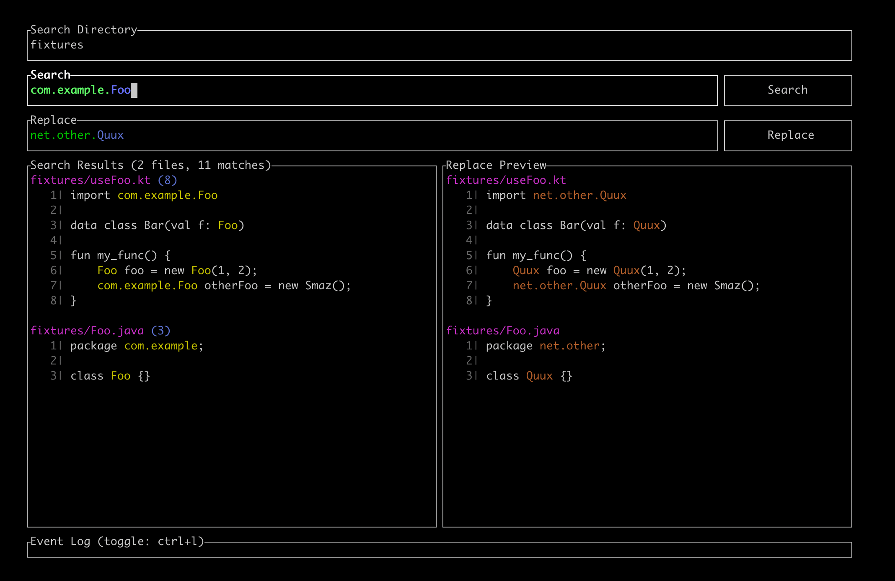

# FQN Renamer
Rename package-level fully-qualified names in Java / Kotlin code.
## What is it?

`fqn-renamer` is a utilty for renaming fully qualified names in Java / Kotlin code. It works with package-level classes and enums.

The tl;dr is if you have an identifier referred to as `com.foo.Bar`, and you want to rename it `net.baz.Quux`, this will perform rewrites of the imports, identifier name, and usages of the fully qualified name:

```diff
- import com.foo.Bar;
+ import net.baz.Quux;

- Bar myBar = new com.foo.Bar()
+ Quux myBar = new net.baz.Quux()
```

## Dependencies
`fqn-renamer` uses [`ripgrep`](https://github.com/BurntSushi/ripgrep) under the hood, so make sure you have that installed.

## Usage

Clone the repository, and run `cargo build`

Command line usage:
```bash
$> fqn-renamer [directory]
```

- Press `Tab` / `Shift+Tab` to navigate the termial interface.
- Press `Esc` to quit the program
- Press `Ctrl+l` to toggle the event log

## Screenshots



## License

[MIT License](license.txt)